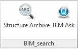
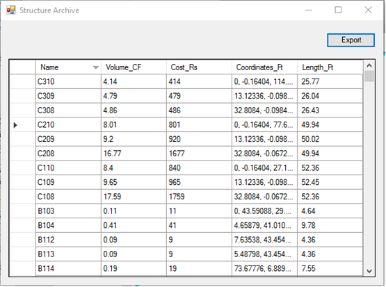
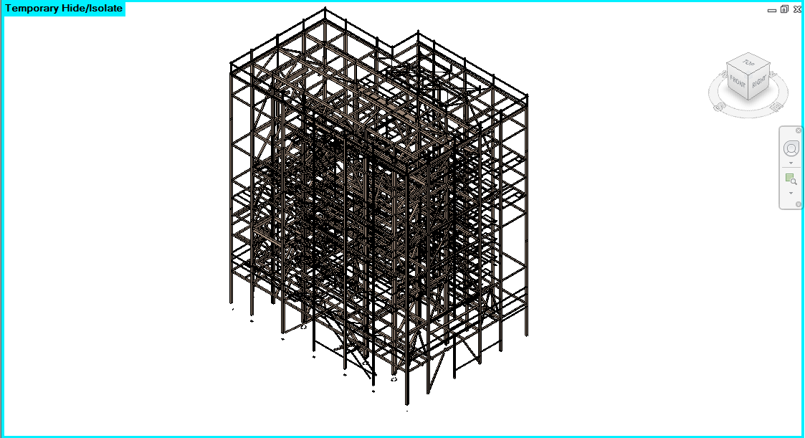
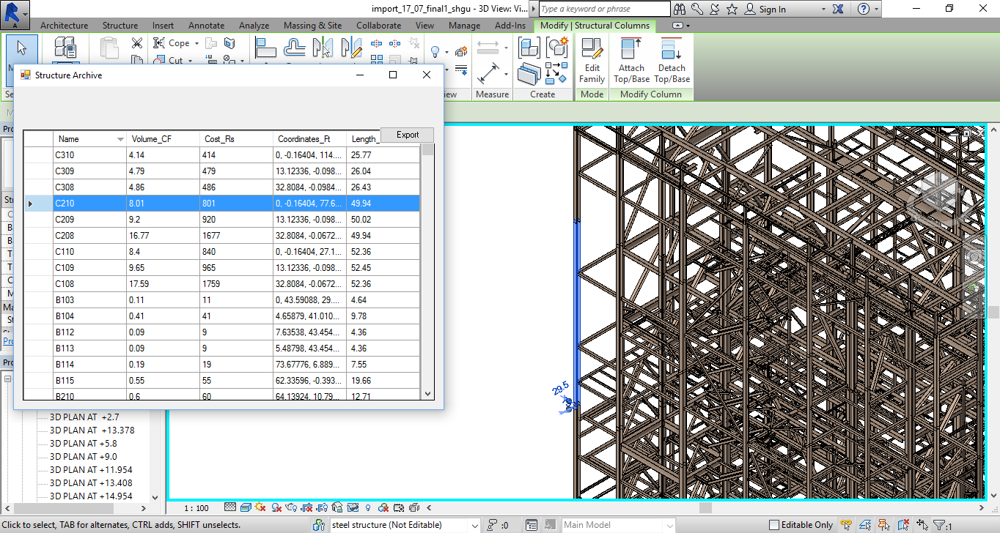
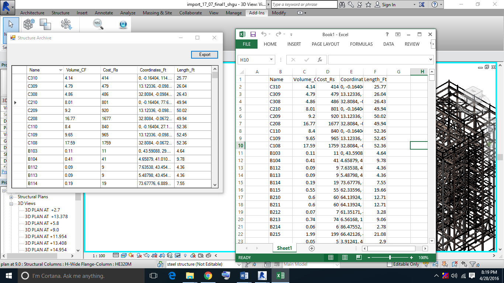
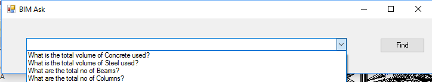
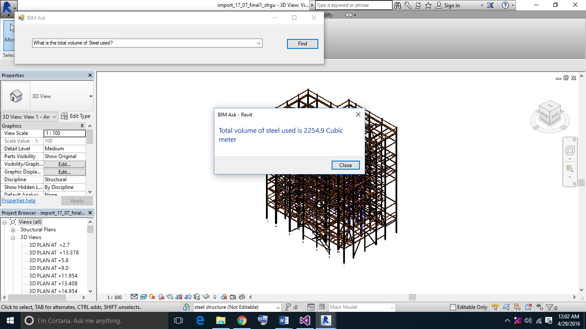

# BIM Search
BIM Search is a plugin developed as a part of my Bachelor's Thesis for [Autodesk Revit](https://www.autodesk.com/products/revit/overview) (A building information modeling software for architects, landscape architects, structural engineers, MEP engineers, designers and contractors)

This plugin has two functions:
- Structure Archive: An archive of the structural information with the ability to visualize each element in the BIM model. The data can also be exported to .xl/.xls format.
- BIM Ask: A search bar to make queries in relation to the structural information in BIM models.

## Plugin

  

The plugin displays two buttons for the two functions mentioned earlier.

## Structure Archive
Clicking on the structure archive button displays a popup window which contains a table of structural elements and an export button.

  

The structure archive button also generates a temporary view of the structural elements of the model.

  

The rows in the popup window are clickable and linked to the corresponding element in the model.
Clicking on a single element displays the position of element in the model.

  

The entire archive can be exported by clicking on the export button in the popup window.

  

## BIM Ask
The Ask button brings up a search query window where the user can type or select the questions from the drop down menu.

  

